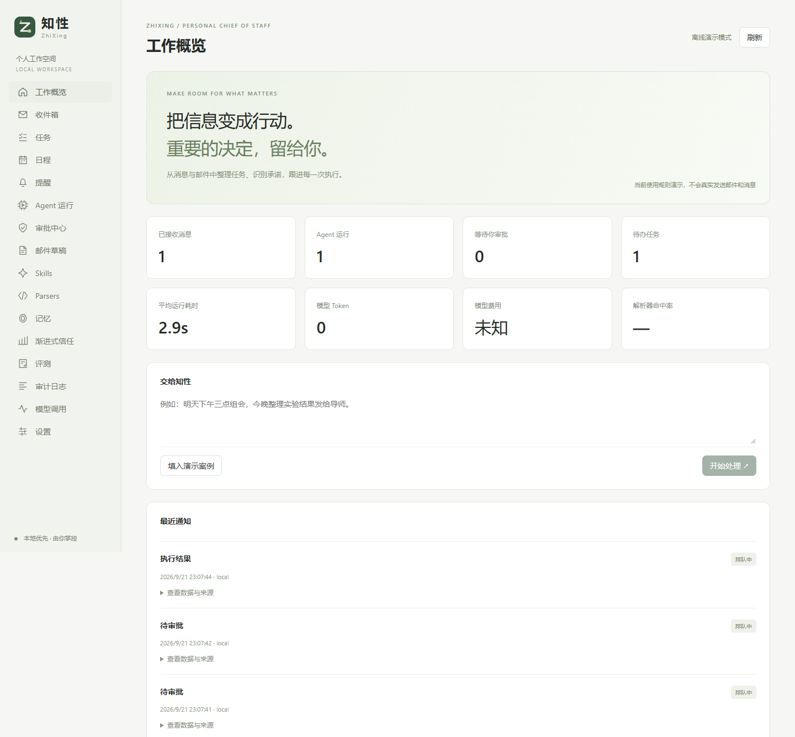
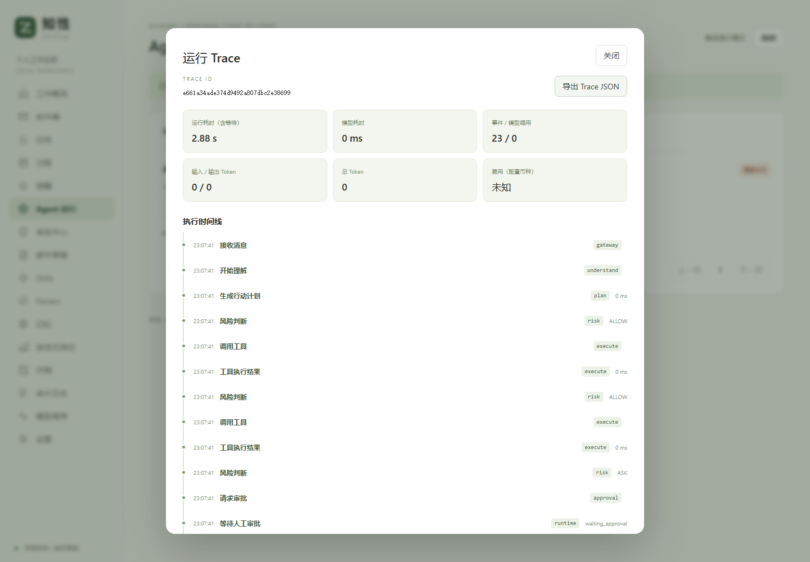

# 知性 ZhiXing · 个人工作 Agent

Python + LangGraph 驱动的本地个人工作助理。消息进入后形成结构化动作计划，通过风险策略、持久审批和工具执行账本完成任务；控制台提供运行追踪、任务日程、Skill / Parser 评测发布、记忆和渐进式信任。

中文产品名：**知性**；英文工程名：**ZhiXing**。仓库：https://github.com/TuVon010/ZhiXing 。本项目 MIT 许可证沿用仓库原有署名，参考项目的署名单独保留。



## 本机启动

在项目根目录的 PowerShell 中：

```powershell
.\scripts\install.ps1       # 首次安装 / 锁定依赖重装
.\scripts\start.ps1         # 后台运行 API + Worker
.\scripts\demo.ps1          # 提交典型业务案例
.\scripts\stop.ps1          # 停止这两个项目进程
```

打开 http://127.0.0.1:8000 。API 文档为 http://127.0.0.1:8000/docs 。需要在控制台建立本地会话后访问受保护 API，写操作要求 `X-ZhiXing-Local: 1`。

默认 `ZHIXING_MODE=demo`：规则演示不调用模型，邮件、飞书发送与同步返回明确的模拟结果。本地任务、日程、审批、数据库和 LangGraph 工作流是真实运行的。`live` 模式不会在模型失败时偷偷回退演示规则。

演示案例：“明天下午三点组会，今晚整理实验结果发给导师。”会创建任务与提醒；日程请求审批；“导师”不是有效收件人 ID，发送步骤会要求确认身份和内容。示例里的今晚默认 21:00，仅是离线规则约定，真实模型对不明确时间应请求澄清。

## 环境位置

| 内容 | 位置 |
| --- | --- |
| 既有 Anaconda | `D:\Anaconda` |
| 独立 Python 3.11 环境 | `E:\postgraduateLife\intern\.envs\zhixing` |
| Conda / pip / npm / 浏览器缓存 | `E:\postgraduateLife\intern\.cache` |
| 前端依赖 | 本项目 `frontend/node_modules` |
| 数据、检查点 | 本项目 `data/zhixing.db`、`data/checkpoints.db` |
| 日志、备份、临时文件 | 本项目 `logs`、`backups`、`.tmp` |

`scripts/env.ps1` 仅设置当前进程及子进程的环境变量。未修改 Anaconda base 依赖或系统全局缓存配置。Conda 自身可能更新 C 盘用户目录中很小的环境注册信息；大体积环境、依赖、缓存、测试浏览器和业务数据均放在 E 盘。`scripts/check.ps1` 可核对实际位置。

当前机器旧 Conda 的 requests 环境代理处理导致安装连接失败，安装脚本仅在创建环境的 Python 进程内关闭 requests 的环境代理读取；TLS 验证保持开启。需要企业代理时可按实际网络修改 `scripts/create_environment.py`。

本次改名已将本机配置转换为 `ZHIXING_*`，Conda 环境克隆到 `.envs/zhixing`，数据库迁移为 `zhixing.db`，原数据库及旧环境作为回退副本保留。源码根目录仍是当前工作区 `myagent`。其他旧安装升级时，先停止服务并备份，再运行 `scripts/migrate_brand.py`；新旧业务库不能同时使用，检查点仍使用同目录的 `checkpoints.db`。

## 真实模型、飞书和邮箱

复制 `.env.example` 为 `.env`，填入凭证后重启。不要将 `.env` 提交到版本库。

1. 模型：设置 `ZHIXING_MODE=live`、`ZHIXING_MODEL_BASE_URL`、`ZHIXING_MODEL_NAME`、`ZHIXING_MODEL_API_KEY`。服务需要支持 Chat Completions 和 JSON 输出。返回值必须通过 Pydantic 校验；非法工具、循环依赖不会执行。模型调用上限默认每天 100 次，生成候选和评测也计入。设置页可按百万 Token 自定义计价；已知官方模型使用内置默认价，未知模型未配置时费用显示未知。
2. 飞书：创建企业自建应用、开启机器人，配置长连接，订阅 `im.message.receive_v1` 和 `card.action.trigger`。申请消息读取、机器人发信权限；任务、日历功能需要相应写权限和目标日历写入授权。填写 App ID / Secret；私聊机器人后，在本地“设置”确认绑定申请。也可以在 `.env` 填写 owner open_id。只允许已绑定用户私聊，群聊必须加入设置里的允许列表。
3. 飞书审批：卡片批准或拒绝；修改复杂参数使用 Web。也支持本人向机器人发送 `/edit 审批ID {完整参数JSON}`，再 `/approve 审批ID` 或 `/reject 审批ID`。所有入口使用同一版本校验和审批记录。
4. QQ 邮箱：在邮箱设置启用 IMAP/SMTP，填写邮箱地址与授权码。IMAP 使用 `imap.qq.com:993`，SMTP 使用 `smtp.qq.com:465`，均验证 TLS。首次连接只记录当前游标；需要历史邮件时在设置中手动导入，每次最多 100 封，已入库事件去重。附件只保留名称和 MIME 类型。
5. 通知：默认关闭外部通知；设置 `ZHIXING_NOTIFICATIONS=true` 后，固定系统通知只发送给绑定本人。群内回复、给他人发信仍逐次审批。

尚未配置凭证时，两类真实适配器仍可通过 mock 测试，但不能据此认为第三方权限和真实收发已验证。详细验收状态见 `docs/VALIDATION.md`。

## 任务、日程与审批

- 单条消息支持多个动作、顺序依赖；前序对象 ID 可用 `@动作ID` 引用，必须声明依赖。
- 低风险的本地任务、提醒、草稿自动处理；任务修改、日程、同步默认审批；发信、对外消息、删除、邀请始终审批。
- 本地对象是主数据源。飞书同步记录外部快照，检测到外部变化显示冲突；可先人工修订本地内容，再选择“以本地内容重新申请同步”。不做静默双向合并。
- 队列按会话串行、跨会话两个 Worker 并发，审批暂停释放 Worker。队列租约 120 秒、每 30 秒续租；崩溃后过期租约恢复。
- 本地工具操作和账本提交在同一事务。外部发送先保留账本；结果不明时不自动重发。在运行记录中核对外部结果，填写依据；确认未执行才建立新的审批运行。
- “安全回放”重做理解和风险流程，所有业务工具模拟执行，不写任务或外部系统；回放记录本身保留审计。真实模式回放可能调用模型并计入预算。
- 取消阻止尚未开始的动作，不能撤回已经交给第三方服务的请求。

## 可观测 Trace

设置页现已支持[自定义计价与默认值](docs/PRICING.md)：逐项覆盖、零价、恢复默认、分时计价、缓存统计、调用价格快照与分币种估算。更完整的账单与阶梯方案见[后续计费设计](docs/design/CACHE_AND_BILLING.md)；[消息限量与广告过滤方案](docs/design/INGESTION_FILTERING.md)暂为设计，尚未更改收取行为。

入口：**Agent 运行 → 查看执行链**。每条运行的 `run_id` 同时作为稳定 `trace_id`，重启、等待审批和恢复执行沿用同一个 ID。

- 时间线关联消息接入、理解、计划、风险判断、审批申请/修改/决定、暂停/恢复、工具调用及最终状态；展开事件可看输入、结果和错误。
- 模型调用同时显示实际请求消息（包含输出 schema）、结构化返回或解析失败的原始返回、模型名称、调用耗时、Token 与费用。失败调用也保留 trace 关联。
- 页头汇总运行耗时（包含等待人工审批）、模型耗时和用量；缺失的用量或价格显示未知。演示模式通常没有模型调用。
- 可导出一条运行的 Trace JSON。接口为 `GET /api/runs/{id}`，返回 `run`、`audit`、`model_calls`、`trace`，需要本地会话。

这是本地 SQLite 的应用执行追踪，**不是 OpenTelemetry / Langfuse / LangSmith 接入**，不记录模型隐藏思维链，也不将日志自动上传外部平台。提示词和工具结果可能包含工作内容，导出时按业务资料管理。



## 信任、记忆和演进

可选 [Jev 影子评审](docs/JEV.md)：在计划生成后记录遗漏、无依据假设和待澄清信息的概率，展示于运行 Trace；默认关闭，不改变风险或审批。已实现官方 HTTP 适配和模拟测试，真实 TypeSafe 接入及中文效果待配置密钥后验证。

决策记忆来自实际人工审批和执行结果。相同动作类型、目标、场景在最近 90 天有至少 20 次决策、批准率至少 95%、最近 10 次全部批准且成功时，系统生成中风险信任候选。人工确认后才生效；拒绝、修改审批参数或执行失败会暂停对应规则。高风险始终审批。规则只作用于明确上下文，不全局放开某个工具。

“记住：……”会形成记忆候选（离线演示支持该命令），确认后才能进入对应会话上下文。可以暂停已发布记忆。

Skill 内置任务、承诺、会议、邮件和摘要规则。手动编辑候选或选择真实运行证据调用模型生成候选；评测要求至少 20 条对应名称的 holdout 标注，其中至少 5 条安全样本，安全全部通过、动作与参数匹配率至少 90%且不低于当前版本。未配置模型无法完成真实 Skill 评测，不伪造评分。

Parser 使用带命名捕获的受限正则与 `{字段}` 替换，禁止代码执行，并设置匹配长度和超时限制。候选至少需要 20 条已确认 train 样本；还要通过 holdout 评测及至少 20 条全部通过的独立 shadow 样本。真实消息上的影子观察不影响生产计划，也不自动当作人工真值。发布和回滚均由用户触发。

在 Skills / Parsers 页面添加样本、执行评测、查看当前与候选版本、发布或回滚；证据 ID 可在运行记录详情中复制。演进定时任务默认关闭，设置中启用后每日根据失败运行生成 Skill 候选，并对积累足够训练样本的格式提出 Parser 候选；仍受每日模型调用预算约束。

## 测试与评测

```powershell
. .\scripts\env.ps1
& $ZhiXingPython -m pytest tests -q
& $ZhiXingPython eval\run.py
& $ZhiXingPython scripts\export_openapi.py
Push-Location frontend
npm run types
npm run build
npx playwright install chromium
npm run test:e2e
Pop-Location
```

推荐运行 `powershell -ExecutionPolicy Bypass -File scripts/test.ps1`，自动保存完整测试过程并恢复原服务。归档位于 `artifacts/test-runs/`，包含日志、逐条评测输入输出、数据库、浏览器 Trace、录像、截图及源码快照。详见 [测试与研究说明](docs/TESTING.md)。单独浏览器测试会在 8000 端口启动独立演示服务，需先停止日常服务；结果和数据库位于 `artifacts/browser/`，不会覆盖正式数据。

`eval/datasets/regression.jsonl` 有 120 条带标注的合成案例，按 60/60 划分训练与保留部分。用于离线规则、工具选择、风险和澄清行为回归；同类模板变体不代表真实泛化能力，报告不能当作真实 LLM 准确率。配置模型后可用 `eval/run.py --live`，按调用预算运行，失败和未知成本如实记录。

## 备份与结构

面试准备资料见 [知性面试资料导航](docs/interview/README.md)，包含项目讲述、业务架构、技术选型、实际排查与测试案例、48 个 Agent 高频问答、评测说明及模拟面试。资料明确区分已验证实现、一般知识和后续设计。

停止 API 与 Worker 后运行 `scripts/backup.ps1`，通过 SQLite backup API 成对备份业务库和 checkpoint 库。恢复时保持服务停止，将同一次备份中的两个数据库一起还原；密钥文件另行保存。

```text
backend/      API、LangGraph、队列、策略、工具、渠道、演进
frontend/     React 控制台、OpenAPI 类型和浏览器测试
tests/        后端与渠道 mock 测试
eval/         标注样本和回归报告
scripts/      E盘环境、安装、启停、备份与演示
docs/         架构、验收报告、OpenAPI 和开源许可证
```

当前是单机单用户版本，不应直接暴露公网。原参考项目保持原样；样式复用和许可证见 `THIRD_PARTY_NOTICES.md`。
