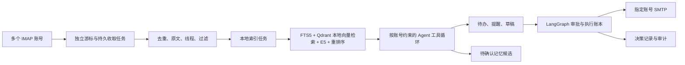

# 知行邮件架构

重构前架构见 archive/pre-mail-20260922/ARCHITECTURE.md。

## 数据流

FastAPI 校验契约、会话和来源并入队；Worker 加载模型、执行网络收取和后台任务。浏览器不能读取凭证，也不能自行替换已批准的发送字段。

## 存储与身份

records 保存新账号、邮件、线程、游标、导入批次、草稿、Agent 会话及旧任务/审批/运行。mail_jobs 是独立持久队列，按账号或会话串行；交互优先于后台索引。任务与 IMAP 租约 120 秒并续租，过期可回收。一个账号认证失败不阻止其他账号。

去重使用账号、文件夹、UIDVALIDITY、UID。Message-ID 用于线程关系，不能作为跨账号唯一键。mail_refs 处理 References / In-Reply-To；相同主题不能直接合并。声明日期、服务端收件日期、本地抓取日期分别保存。

SQLite WAL 支持并发读取，BEGIN IMMEDIATE 保护领取、版本校验和账本。SQLite 保留邮件正文、FTS5、业务记录和可重建的向量缓存；Qdrant local 持久化存储向量并执行近邻查询，索引目录位于 `data/qdrant`。Qdrant local 使用进程级文件锁，在线向量读写由单一 Worker 串行承担，API 只通过持久队列请求检索。备份前停止服务，备份数据库与 Qdrant 索引；索引可由 SQLite 缓存重建。

选择 Qdrant local 是为了在 Windows + 本地 Anaconda 环境免 Docker运行。Milvus Lite 官方支持的平台目前不含 Windows；Milvus standalone 在 Windows 需要 Docker Desktop 和 WSL2，因而不符合当前的本地免 Docker部署约束。切换 Milvus 需要先引入并验证 WSL2/Docker 运行与备份方案。

## 恢复和审批

Agent 决策、待执行工具请求及结果持久化在 assistant_turn；动作进入原有 LangGraph checkpoint。审批 interrupt 释放 Worker。运行冻结记忆、Skill、Parser、策略和模型版本。

本地工具与账本同事务。外部写入先保留账本，崩溃后无法证明未执行就进入待核对。重放先读取已完成账本，再检查草稿状态。

草稿发送字段、版本哈希和动作入队同事务冻结；修改草稿取消旧运行与审批并提升版本。正在发送、结果不明或已接受的草稿不可修改。高风险发信不受信任提升放行。

## 可观测性和边界

turn、run、model_call 和 audit 具有稳定关联。检索记录关键词、向量、融合和最终排名。Trace 保存工具参数、结果、错误、用量和价格快照；记录显式工具决策，不记录隐藏思维链。缓存命中使用服务商 usage，缺失时显示未知。

本地过滤和归档不操作远端文件夹。浏览全部邮箱不代表授权全账号检索。第三方邮件陈述不能直接成为已生效用户偏好。历史迁移不自动分析或发送。
