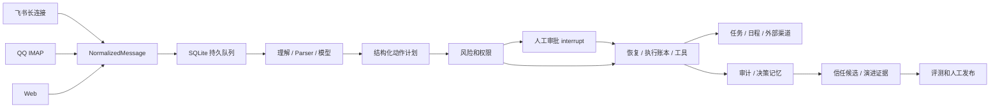

# 实现说明

## 数据流

## 运行边界

- API 进程负责本地会话、查询和接收命令；Worker 进程负责两个执行线程、渠道和定时任务。
- SQLite 业务库包含统一 records 表、jobs、ledger 和 migrations。records 的 kind 区分消息、动作运行、审批、业务对象、版本与审计，body 为结构化 JSON；这是单机版本的存储选择。字段边界通过 Pydantic 输入、动作白名单和服务校验约束。
- LangGraph 使用独立 SQLite checkpointer。启动迁移版本为 1；当前没有旧项目数据库导入，也不共享开源 Pulse 的数据库。
- 入站事件唯一键是 source + message_id；邮件 ID 包含账号、UIDVALIDITY、UID。业务对象保留 run_id，run 保留原始消息记录。
- Run 固定 Skill、Parser、风险代码版本和信任规则 ID。暂停/撤销权限会即时限制执行，新发布规则不会扩大已开始 Run 的授权。
- 本地写入与 ledger 原子提交；外部 API 和本地 SQLite 之间没有分布式事务，因此不声称外部系统严格 exactly-once。保留 executing 记录并要求人工核对，优先防止重复发送。
- 用户修改审批参数后版本递增，不把“修改”等同“批准”。多个入口的决定通过 BEGIN IMMEDIATE 串行竞争。
- 队列支持进程崩溃后租约恢复；审批正好发生在暂停与 Worker 释放之间时保留新的 resume，已有回归测试。

## 模型与渠道

兼容模型接口使用 `/chat/completions` 的 JSON 输出，加 Pydantic schema 校验。工具执行不由模型直接触发。每日请求预算在事务内先预留，模型失败也计入预算。

飞书使用官方 Python SDK 消费长连接；HTTP 工具调用按飞书 REST 契约执行。任务应用身份需有权限并给绑定用户指派任务，日历需要配置已授权的 calendar_id。邮件采用 Python 标准库 IMAP、MIME 和 SMTP。

默认服务仅绑定 127.0.0.1。Host 白名单防止 DNS rebinding；会话 cookie 为 HttpOnly / SameSite Strict，写操作要求标记头并检查 Origin。不提供跨源 CORS。该边界针对本机浏览器访问，不替代多用户登录或操作系统权限隔离。

## 评测与发布

Skill 的真实评测需要模型；Parser 评测可独立本地运行。评测结果包含内容摘要哈希、样本量、候选/基线分数和安全结果，发布时重新校验哈希，避免评测后换内容。独立 shadow 样本不允许复用 train / holdout 的同一文本。回滚只允许曾发布版本。

LLM 影子输出不是人工标注，不能直接转成评测通过证据。基于模板的120条离线样本用于工程回归，不用于证明模型可靠性。

## Trace 关联

每条 Run 的 ID 就是 trace_id；审计、模型调用记录写入 run_id 和 trace_id，工具额外关联 action_id，审批额外关联 approval_id。ContextVar 只传递当前执行线程的运行 ID，进入理解节点时设置，退出时恢复，避免并发运行混用。

`GET /api/runs/{id}` 聚合完整事件和关联模型调用，不沿用旧详情接口的 1000 条截断。模型请求发出前持久化，HTTP/JSON 解析失败时保留关联、耗时、已返回的 usage 和原始模型正文；不保存 Authorization 请求头。旧失败记录可通过 MODEL_FAILED 的 call_id 找回。

运行耗时包括排队与人工等待，模型耗时只累计模型请求时间，两者在 UI 中区分。未返回 usage 或未配置价格时，不把未知值当成零。Trace JSON 导出只在用户本地浏览器下载，不发送给外部遥测系统。
