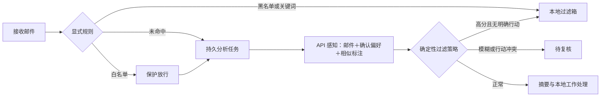

# 邮件分类反馈、API 评测与版本发布

本功能将人工纠正、后续分类参考和提示词版本管理连接起来。使用现有模型 API，不训练模型参数，也不自动发布模型总结的规则。正常分类只调用一次模型，同时输出分类、垃圾参考分、摘要、优先级、回复意图及工作事项。

## 使用流程

1. 选择一个邮箱，并在账号设置中显式开启自动分析，或在邮件详情手动分析。未开启分析的邮件只收取和索引，不调用分类 API。
2. 打开邮件详情 → **调整 AI 判断**。只修改需要纠正的字段，点击**保存调整**。垃圾判断与内容分类分开：科研订阅可以是工作邮件，广告也不必然是垃圾。
3. 抽查判断正确的邮件时，点击**确认所选判断（抽查）**；垃圾判断需明确选择“正常 / 垃圾 / 不能确定”，不能从“工作”推断“正常”。抽查会确认当前选择的分类、优先级与回复意图。
4. 到 **设置与计价 → 分类反馈与效果验证**，查看当前邮箱的确认标注、参考案例配置和评测报告。旧纠正须点击**导入已有人工纠正**，仅迁移旧人工覆盖的明确字段。
5. 可按需勾选生成长期偏好候选；到**记忆**页确认后才会生效。仅纠正当前邮件不会自动建立整个发件人的白名单。

确认标注在保存时立即生效；新参考案例从后续分析开始使用，已分析邮件不会因此自动批量重跑。标签可**移出标注集**，保留当前邮件的人工纠正和旧评测证据。撤回不会自动撤销已经发布的指导原则；需单独回滚分类版本。

## 默认分类与过滤



默认 `classification_mode=model`：收取时不再因内置“退订链接 / 订阅”启发规则自动过滤。用户配置的白名单优先，明确黑名单、域名及关键词过滤仍有效。配置 `classification_mode=rules` 可恢复规则分类过滤；感知仍可生成摘要，但不改变规则过滤决定。

默认模型策略：垃圾参考分 ≥ 0.9、自评置信分 ≥ 0.85，且没有回复需求、待办或日程时才移入本地过滤箱；参考分 ≥ 0.5 或行动与垃圾判断冲突时待复核；其余放行。人工明确的正常、垃圾或不能确定覆盖模型判断。评分与置信度未经校准，不是概率；所有过滤均可恢复，不操作远端邮箱删除。

自动分析仍受每账号每小时额度、全局模型调用预算和启停开关限制。明确规则拦截的邮件默认不分析；用户可在详情手动分析或纠正。待复核、过滤及回收站邮件不进入普通知识检索；纠正为正常后重新索引。

## 标注与上下文隔离

- 当前标注：`mail_classification_label`；不可变修订：`mail_classification_label_revision`。保存原邮件快照、内容哈希、人工确认字段、模型原判断、实际过滤决定与版本。
- 邮件覆盖与标注修订在同一 SQLite 事务内保存。页面提交 `expected_revision`，冲突要求刷新，重复提交不增加相同修订。
- 仅正常可见、过滤、待复核及归档邮件的有效确认标签可成为样本。撤回、回收站、来源消失及内容变更的标签排除。
- 参考案例限定当前账号，默认最多 3 条，允许 0—5 条。采用中文分词后的词集合相似度选取，不能仅凭发件人相同选择；这部分是有限示例检索，不是参数训练。
- 示例只使用优化集；排除当前邮件、相同正文、同线程及关联重复模板的整个分组。正文最多 350 字、主题最多 120 字、备注最多 160 字；偏好总长最多 1,000 字。
- 每次分析保存 `classification_context`，冻结基础提示词、指导原则、确认偏好、案例及修订号、模型与端点哈希、规则和配置版本。普通 API 请求不含密钥快照。

长期偏好仅使用 `published`、类型为 `preference`、作用域为当前账号或用户确认全局的记忆。邮件正文和历史示例正文均为不可信数据，不能改变工具权限或发送流程。

## 对比评测

选择优化集或保留集、最多邮件数，再点击**开始三组对比**：

| 方案 | 模型输入 |
|---|---|
| 只看邮件 | 原邮件及当前基础分类提示词 / 已发布指导原则 |
| 加入偏好 | 上述输入＋确认的长期偏好 |
| 加入纠正案例 | 上述输入＋有限的相似确认案例 |

三组使用同一目标邮件、确认标签、规则及版本快照。目标邮件所在分组的标签与来源偏好排除，避免答案泄漏；保留集标签始终不参与示例及候选生成。

样本先按线程或规范化模板做关联分组，再由组哈希确定约 80% 优化集 / 20% 保留集，实际小样本比例可能不均衡。模板规范化仅覆盖地址、数字编号及标点变化，不能保证语义相近模板全部识别。新增关联标签可能改变分组，发布前会重新核对；候选优化证据与当前保留集重复时拒绝对比。正式质量评测仍需人工检查模板隔离。

每个方案额外执行两条边界用例：科研订阅不应仅因退订链接过滤；含提示注入的任务邮件不应直接过滤。它们是基本回归门槛，不能代表全面安全评测。最多调用数为 `(实际邮件数＋2)×3`；候选与当前版本对比为 `(实际邮件数＋2)×2`。

每次模型调用复用 `model_client.model_json` 的预算、Trace 与价格快照。每个持久任务只处理一个比较单元，结果落库后推进游标。已经保存的预测在重启后复用；若崩溃发生在 API 返回与预测落库之间，可能重复无副作用的分类调用并产生额外费用。评测不改变邮件状态，不创建任务、日程或草稿，也不发送邮件。

报告包含逐例输入输出、案例来源、版本、延迟、原始 usage、缓存字段及费用。每次本地导出生成独立文件，不覆盖前一次快照。没有价格或缓存字段时显示未知；不合并不同币种。取消保留已完成的预测，正在调用的请求可能仍产生费用。演示模式标记**未真实验证**，不显示虚构效果指标。

## 指标口径

| 指标 | 计算方式 |
|---|---|
| 各字段准确率 | 与人工确认一致数 / 该字段有效确认数 |
| 误杀率 | 正常标签邮件中被策略过滤数 / 正常标签邮件数 |
| 漏拦率 | 垃圾标签邮件中未被策略过滤数 / 垃圾标签邮件数 |
| 待复核率 | 正常或垃圾标签中策略转待复核数 / 正常或垃圾标签数 |

“不能确定”不作为二元垃圾标签；未确认字段不当成正确答案；分母为零显示未测量。漏拦率将转待复核的垃圾计入未自动拦截，因此保守策略可能有较高漏拦率。调用失败独立统计，不能靠跳过失败提高指标，失败会阻止发布。

纠正集天然偏向错误样本，不能用于宣称整个邮箱的总体准确率。请随机抽查正常邮件和过滤邮件，覆盖科研订阅、营销、招聘、验证码、工作安排、引用及注入文本；保存抽样方式。少量样本的 100% 只说明该批通过，不能证明生产环境不误判。

## 候选、发布和回滚

至少 5 条优化集确认标注后可生成补充指导原则。API 只总结有限原则，基础安全提示词不交给模型修改，候选不会自动生效。

发布前人工审阅候选，并对比当前版本与候选。要求真实 API 保留集评测完成，无失败、边界用例通过；保留集至少 10 封，分类及垃圾判断各至少 10 条标签，正常与垃圾各至少 5 封。分类、垃圾判断及已标注的优先级、回复意图准确率不低于当前版本，误杀和漏拦率不升高。模型、端点、提示词、规则、案例配置、标签或分组改变需重新评测。

这只是最低发布门槛，并非统计显著性保证。候选发布仅切换当前账号的指导原则；新分析使用新版本，已开始分析保留原快照。**回滚上一版本**恢复上一指针，原证据与报告保留。

## 代码和接口

| 层次 | 文件 / 职责 |
|---|---|
| 领域规则 | `backend/app/modules/mail/classification.py`：标签语义、哈希、过滤决定、指标 |
| 数据层 | `repositories/classification.py`：原子纠正、修订与版本指针 |
| 服务层 | `services/classification.py`：分组、上下文、候选、持久评测、发布门槛 |
| 控制层 | `routes/classification.py`：账号作用域、参数验证、撤回、导出 |
| 基础提示词 | `prompts/perception.md`：可信边界、分类与工作提取契约 |
| 工作流 | `perception.py`、`workers/mail_jobs.py`：分析、存储及任务分派 |
| 界面 | `ClassificationSettings.tsx`、`MailboxPage.tsx`：纠正、抽查和版本管理 |

账号接口前缀为 `/api/mail/accounts/{account_id}/classification`：

- `GET /`：样本、版本、配置、评测与候选；支持 `limit/offset`。
- `POST /config`：示例启停及数量。
- `POST /labels/backfill`、`POST /labels/{id}/withdraw`：明确旧纠正迁入及撤回。
- `POST /candidates`、`POST /evaluations`：候选生成、创建比较任务。
- `GET /evaluations/{id}`、`POST /evaluations/{id}/cancel`、`POST /evaluations/{id}/export`：报告、取消和本地导出。
- `POST /candidates/{id}/publish`、`POST /rollback`：人工发布及回滚。
- `/api/mail/traces/{id}`：分析、候选生成和评测的模型记录及审计。

所有修改仍校验本地会话。每个账号接口服务端检查记录作用域。新增数据使用现有记录表，不做破坏性数据库迁移，不自动导入、重跑或删除真实邮件。

## 复现工程验证

在项目根目录 PowerShell 执行：

```powershell
. .\scripts\env.ps1
$classificationRun = Join-Path $ZhiXingRoot ('artifacts\classification-checks\' + (Get-Date -Format 'yyyyMMdd-HHmmss-ffff'))
New-Item -ItemType Directory -Force -Path $classificationRun | Out-Null
& $ZhiXingPython -m pytest tests\test_mail_classification.py -v --capture=tee-sys "--basetemp=$classificationRun\databases" "--junitxml=$classificationRun\junit.xml" *> "$classificationRun\backend.log"
$env:ZHIXING_E2E_BASE_URL = 'http://127.0.0.1:8018'
$env:ZHIXING_TEST_OUTPUT = Join-Path $classificationRun 'browser'
$env:ZHIXING_E2E_VIDEO = 'on'
Push-Location frontend
npm.cmd run build *> "$classificationRun\frontend-build.log"
npm.cmd run test:e2e -- classification.spec.ts perception.spec.ts --trace on *> "$classificationRun\browser.log"
Pop-Location
```

测试使用独立数据库、合成邮件与模拟 API，禁用真实收发；浏览器演示验证操作，不证明真实分类质量。完整回归与源码留档使用现有 `scripts/test.ps1`；失败轮次仍需保留。

真实质量验证：配置真实 API、确认当前邮箱样本，先运行三组优化集比较，再生成候选并单独运行保留集对比；查看评测 Trace、导出完整报告。报告保存于本地 `data/mail-evaluations`，包含私人邮件，Git 已忽略 `data/` 与 `artifacts/`。不要把真实邮件、密钥或测试截图混入公共样本。
